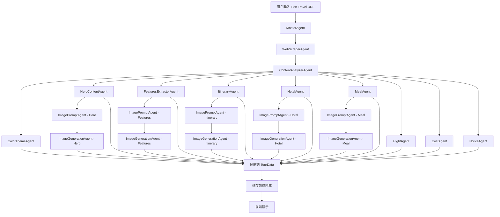

# PackGo Travel AI Agents 配合方案

**作者**：Manus AI  
**日期**：2026-01-26  
**版本**：1.0

---

## 執行摘要

本文檔詳細說明 PackGo Travel 的 AI Agents 如何配合，以實現 Sipincollection 風格的行程詳情頁面設計。本文檔涵蓋 Agents 的職責分工、協作流程、資料傳遞、錯誤處理、以及具體的實作範例。

**核心目標**：
1. 明確每個 Agent 的職責和輸入輸出
2. 定義 Agents 之間的協作流程
3. 實作 Partial Success 策略，確保即使部分 Agent 失敗，也能顯示完整頁面
4. 提供具體的實作範例和測試案例

---

## 目錄

1. [Agents 職責分工](#一agents-職責分工)
2. [Agents 協作流程](#二agents-協作流程)
3. [資料傳遞與轉換](#三資料傳遞與轉換)
4. [錯誤處理與 Fallback](#四錯誤處理與-fallback)
5. [實作範例](#五實作範例)
6. [測試與驗證](#六測試與驗證)

---

## 一、Agents 職責分工

### 1.1 Agents 總覽

PackGo Travel 的 AI Agents 架構採用**多代理人協調模式**，每個 Agent 負責特定的任務，由 MasterAgent 統一協調。

| Agent 名稱 | 職責 | 輸入 | 輸出 | 優先級 |
|-----------|------|------|------|--------|
| **MasterAgent** | 協調所有 Agents | Lion Travel URL | 完整 TourData | P0（必須） |
| **WebScraperAgent** | 抓取外部網站內容 | URL | 原始 HTML | P0（必須） |
| **ContentAnalyzerAgent** | 分析和結構化內容 | 原始 HTML | 結構化資料 | P0（必須） |
| **ColorThemeAgent** | 生成配色方案 | 目的地 | ColorTheme | P1（高） |
| **HeroContentAgent** | 生成 Hero Section 內容 | 行程資訊 | 副標題、關鍵詞 | P1（高） |
| **FeaturesExtractorAgent** | 提取核心特色 | 行程資訊 | 3 個特色 | P1（高） |
| **ImagePromptAgent** | 生成圖片提示詞 | 景點/活動描述 | 圖片提示詞 | P2（中） |
| **ImageGenerationAgent** | 生成圖片 | 圖片提示詞 | 圖片 URL | P2（中） |
| **ItineraryAgent** | 生成每日行程 | 行程資料 | 每日行程 | P1（高） |
| **HotelAgent** | 生成飯店介紹 | 飯店資料 | 飯店介紹 | P2（中） |
| **MealAgent** | 生成餐食介紹 | 餐食資料 | 餐食介紹 | P2（中） |
| **FlightAgent** | 生成航班資訊 | 航班資料 | 航班資訊 | P2（中） |
| **CostAgent** | 生成費用說明 | 費用資料 | 費用說明 | P2（中） |
| **NoticeAgent** | 生成旅遊須知 | 須知資料 | 旅遊須知 | P2（中） |

**優先級說明**：
- **P0（必須）**：如果失敗，整個流程中斷
- **P1（高）**：如果失敗，使用 Fallback，但影響用戶體驗
- **P2（中）**：如果失敗，使用 Fallback，影響較小

---

### 1.2 核心 Agents 詳細說明

#### 1.2.1 MasterAgent

**職責**：協調所有 Agents，確保流程順利進行

**輸入**：
```typescript
interface MasterAgentInput {
  url: string; // Lion Travel URL
}
```

**輸出**：
```typescript
interface MasterAgentOutput {
  tourData: TourData; // 完整行程資料
  errors: AgentError[]; // 錯誤記錄
}
```

**核心邏輯**：
1. 呼叫 WebScraperAgent 抓取網站內容
2. 呼叫 ContentAnalyzerAgent 分析內容
3. 並行呼叫所有內容生成 Agents（ColorThemeAgent、HeroContentAgent、FeaturesExtractorAgent 等）
4. 並行呼叫所有圖片生成 Agents（ImagePromptAgent、ImageGenerationAgent）
5. 匯總所有結果，處理錯誤
6. 返回完整 TourData

**Partial Success 策略**：
- 如果某個 P1 或 P2 Agent 失敗，使用 Fallback，繼續執行
- 如果某個 P0 Agent 失敗，中斷流程，返回錯誤

---

#### 1.2.2 WebScraperAgent

**職責**：抓取 Lion Travel 網站的行程詳情頁面

**輸入**：
```typescript
interface WebScraperInput {
  url: string; // Lion Travel URL
}
```

**輸出**：
```typescript
interface WebScraperOutput {
  html: string; // 原始 HTML
  metadata: {
    title: string;
    description: string;
    images: string[];
  };
}
```

**實作方式**：
- 使用 Puppeteer 或 Playwright 抓取網頁
- 提取 HTML 和 metadata
- 處理動態載入的內容

---

#### 1.2.3 ContentAnalyzerAgent

**職責**：分析原始 HTML，提取結構化資料

**輸入**：
```typescript
interface ContentAnalyzerInput {
  html: string; // 原始 HTML
}
```

**輸出**：
```typescript
interface ContentAnalyzerOutput {
  title: string;
  country: string;
  city: string;
  days: number;
  nights: number;
  price: number;
  currency: string;
  highlights: string[];
  itinerary: RawItinerary[];
  hotels: RawHotel[];
  meals: RawMeal[];
  flights: RawFlight[];
  cost: RawCost;
  notices: RawNotice[];
}
```

**實作方式**：
- 使用 Cheerio 或 JSDOM 解析 HTML
- 使用 LLM 提取結構化資料
- 驗證資料完整性

---

#### 1.2.4 ColorThemeAgent

**職責**：根據目的地生成配色方案

**輸入**：
```typescript
interface ColorThemeInput {
  country: string;
  city: string;
}
```

**輸出**：
```typescript
interface ColorTheme {
  primary: string; // 主色（如：#7B68EE）
  secondary: string; // 輔助色（如：#A9C5D6）
  accent: string; // 強調色（如：#FFD700）
}
```

**實作方式**:
- 使用預定義的配色方案資料庫
- 如果找不到對應的目的地，使用 Pack&Go 品牌標準色作為 Default
- 確保配色符合 Sipincollection 的風格

**Fallback（Pack&Go 品牌標準色）**:
```typescript
// Pack&Go 品牌標準色（用於未知目的地）
const PACKGO_BRAND_COLORS: ColorTheme = {
  primary: '#1A1A1A',   // 深灰黑（專業、穩重）
  secondary: '#F5F5F5', // 淺灰白（乾淨、現代）
  accent: '#E63946',    // 紅色（活力、冒險）
};

// 如果找不到目的地配色，使用品牌標準色
const DEFAULT_COLOR_THEME = PACKGO_BRAND_COLORS;
```

**⚠️ Tech Lead 審查意見**：
> 當使用者輸入「冰島」或「南極」等未定義地點時，系統不應崩潰或變全白。務必在 `getDestinationColors` 中加入 Default 配色方案（Pack&Go 品牌標準色），當查無地點時自動降級使用。

---

#### 1.2.5 HeroContentAgent

**職責**：生成 Hero Section 的內容（副標題、關鍵詞）

**輸入**：
```typescript
interface HeroContentInput {
  title: string;
  country: string;
  city: string;
  days: number;
  highlights: string[];
}
```

**輸出**：
```typescript
interface HeroContentOutput {
  subtitle: string; // 副標題（如：「馬特拉古城·蘑菇村彩色島·威尼斯五星連泊」）
  keywords: string[]; // 關鍵詞（如：「米其林一星」、「房內私湯」、「札幌漫遊」）
}
```

**Skill Prompting**：
```typescript
const HERO_CONTENT_SKILL = {
  role: "SENIOR_TRAVEL_COPYWRITER",
  persona: "資深旅遊文案編輯，擅長提煉行程亮點，創作吸引人的標題和關鍵詞",
  instructions: [
    "分析行程亮點，提取 3-5 個最吸引人的關鍵詞",
    "副標題應簡潔有力，突出行程的獨特性（15-30字）",
    "關鍵詞應使用「·」分隔，營造詩意感",
    "避免使用過於商業化的詞彙",
  ],
};
```

**Fallback**：
```typescript
const fallbackHeroContent: HeroContentOutput = {
  subtitle: input.title, // 使用原始標題
  keywords: [], // 空陣列
};
```

---

#### 1.2.6 FeaturesExtractorAgent

**職責**：從行程內容中提取 3 個核心特色

**輸入**：
```typescript
interface FeaturesExtractorInput {
  itinerary: string;
  hotels: string;
  meals: string;
  highlights: string[];
}
```

**輸出**：
```typescript
interface Feature {
  label: string; // 標籤（如：ONSEN、LOBBY、STAY）
  title: string; // 標題（如：「星野 TOMAMU 度假村」）
  description: string; // 說明（100-150字）
}

interface FeaturesExtractorOutput {
  features: Feature[]; // 3 個特色
}
```

**Skill Prompting**：
```typescript
const FEATURES_EXTRACTOR_SKILL = {
  role: "TRAVEL_EXPERIENCE_CURATOR",
  persona: "旅遊體驗策展人，擅長從行程中提取最具吸引力的特色體驗",
  instructions: [
    "從行程中提取 3 個最具吸引力的特色體驗",
    "每個特色應包含標籤、標題、說明",
    "標籤應簡潔有力（如：ONSEN、LOBBY、STAY）",
    "說明應具體生動，突出體驗的獨特性（100-150字）",
  ],
};
```

**Fallback**：
```typescript
const fallbackFeatures: Feature[] = []; // 空陣列
```

---

#### 1.2.7 ImagePromptAgent

**職責**：生成圖片提示詞

**輸入**：
```typescript
interface ImagePromptInput {
  type: 'hero' | 'feature' | 'itinerary' | 'hotel' | 'meal';
  context: {
    country?: string;
    city?: string;
    keywords?: string[];
    title?: string;
    description?: string;
  };
}
```

**輸出**：
```typescript
interface ImagePromptOutput {
  prompt: string; // 圖片提示詞
}
```

**實作方式**：
- 根據 `type` 生成不同的提示詞
- 使用專業攝影術語（如：golden hour lighting、cinematic、wide-angle）
- 確保提示詞包含「No text, no watermarks」

**範例**：
```typescript
// Hero Image
const heroPrompt = `
A stunning landscape photograph of ${city}, ${country}.
Keywords: ${keywords.join(', ')}.
Style: Cinematic, wide-angle, golden hour lighting, high-quality travel photography.
Mood: Inspiring, adventurous, luxurious.
No text, no watermarks, no people.
`;

// Feature Image
const featurePrompt = `
A high-quality photograph of ${title}.
Description: ${description}.
Style: Professional travel photography, warm lighting, inviting atmosphere.
No text, no watermarks, no people.
`;
```

---

#### 1.2.8 ImageGenerationAgent

**職責**：生成圖片

**輸入**：
```typescript
interface ImageGenerationInput {
  prompt: string; // 圖片提示詞
}
```

**輸出**：
```typescript
interface ImageGenerationOutput {
  url: string; // 圖片 URL
}
```

**實作方式**：
- 使用 Manus AI 的圖片生成 API
- 如果生成失敗，使用 Unsplash 作為 Fallback

**Fallback**：
```typescript
const fallbackImageUrl = `https://source.unsplash.com/1600x900/?${keywords.join(',')}`;
```

---

### 1.3 輔助 Agents

**ItineraryAgent**、**HotelAgent**、**MealAgent**、**FlightAgent**、**CostAgent**、**NoticeAgent** 的職責和實作方式與現有架構相同，不再贅述。

---

## 二、Agents 協作流程

### 2.1 完整流程圖



### 2.2 步驟說明

**Phase 1：抓取和分析（P0 - 必須成功）**

1. **用戶輸入 Lion Travel URL**
2. **MasterAgent** 接收 URL，開始協調流程
3. **WebScraperAgent** 抓取網站內容，返回原始 HTML
4. **ContentAnalyzerAgent** 分析 HTML，提取結構化資料

**如果 Phase 1 失敗**：
- 中斷流程，返回錯誤訊息給用戶
- 錯誤訊息範例：「無法抓取行程資訊，請檢查 URL 是否正確」

---

**Phase 2：內容生成（P1 - 高優先級）**

5. **ColorThemeAgent** 根據目的地生成配色方案
6. **HeroContentAgent** 生成 Hero Section 內容（副標題、關鍵詞）
7. **FeaturesExtractorAgent** 提取 3 個核心特色
8. **ItineraryAgent** 生成每日行程
9. **HotelAgent** 生成飯店介紹
10. **MealAgent** 生成餐食介紹
11. **FlightAgent** 生成航班資訊
12. **CostAgent** 生成費用說明
13. **NoticeAgent** 生成旅遊須知

**如果 Phase 2 某個 Agent 失敗**：
- 使用 Fallback，繼續執行
- 記錄錯誤，但不中斷流程

---

**Phase 3：圖片生成（P2 - 中優先級）**

14. **ImagePromptAgent** 為 Hero、Features、Itinerary、Hotel、Meal 生成圖片提示詞
15. **ImageGenerationAgent** 生成所有圖片

**如果 Phase 3 某個 Agent 失敗**：
- 使用 Unsplash 作為 Fallback
- 記錄錯誤，但不中斷流程

---

**Phase 4：匯總和儲存（P0 - 必須成功）**

16. **MasterAgent** 匯總所有結果到 TourData
17. **儲存到資料庫**
18. **前端顯示**

**如果 Phase 4 失敗**：
- 中斷流程，返回錯誤訊息給用戶
- 錯誤訊息範例：「行程生成成功，但儲存失敗，請稍後再試」

---

### 2.3 並行執行策略

為了提升效能，部分 Agents 可以並行執行：

**並行組 1：內容生成 Agents**
- ColorThemeAgent
- HeroContentAgent
- FeaturesExtractorAgent
- ItineraryAgent
- HotelAgent
- MealAgent
- FlightAgent
- CostAgent
- NoticeAgent

**並行組 2：圖片提示詞生成 Agents**
- ImagePromptAgent - Hero
- ImagePromptAgent - Features
- ImagePromptAgent - Itinerary
- ImagePromptAgent - Hotel
- ImagePromptAgent - Meal

**並行組 3：圖片生成 Agents**
- ImageGenerationAgent - Hero
- ImageGenerationAgent - Features
- ImageGenerationAgent - Itinerary
- ImageGenerationAgent - Hotel
- ImageGenerationAgent - Meal

**實作方式**：
```typescript
// 並行執行內容生成 Agents
const [
  colorTheme,
  heroContent,
  features,
  itinerary,
  hotels,
  meals,
  flights,
  cost,
  notices,
] = await Promise.allSettled([
  colorThemeAgent(analyzedData.country),
  heroContentAgent(analyzedData),
  featuresExtractorAgent(analyzedData),
  itineraryAgent(analyzedData),
  hotelAgent(analyzedData),
  mealAgent(analyzedData),
  flightAgent(analyzedData),
  costAgent(analyzedData),
  noticeAgent(analyzedData),
]);

// 處理結果
const colorThemeResult = colorTheme.status === 'fulfilled' ? colorTheme.value : DEFAULT_COLOR_THEME;
const heroContentResult = heroContent.status === 'fulfilled' ? heroContent.value : fallbackHeroContent;
// ... 其他結果同理
```

---

## 三、資料傳遞與轉換

### 3.1 資料流

```
Lion Travel URL
  ↓
WebScraperAgent → 原始 HTML
  ↓
ContentAnalyzerAgent → 結構化資料
  ↓
┌─────────────────┬─────────────────┬─────────────────┐
↓                 ↓                 ↓                 ↓
ColorThemeAgent   HeroContentAgent  FeaturesExtractor ItineraryAgent
  ↓                 ↓                 ↓                 ↓
ColorTheme        HeroContent       Features          Itinerary
  ↓                 ↓                 ↓                 ↓
  └─────────────────┴─────────────────┴─────────────────┘
                          ↓
                    TourData（匯總）
                          ↓
                      資料庫
                          ↓
                      前端顯示
```

### 3.2 資料轉換範例

**ContentAnalyzerAgent 輸出 → HeroContentAgent 輸入**

```typescript
// ContentAnalyzerAgent 輸出
const analyzedData = {
  title: "北海道二世谷雅奢6日",
  country: "日本",
  city: "北海道",
  days: 6,
  highlights: [
    "米其林一星鑰旅宿",
    "房內私湯享受",
    "札幌漫遊",
    "和牛蟹宴",
  ],
};

// 轉換為 HeroContentAgent 輸入
const heroContentInput: HeroContentInput = {
  title: analyzedData.title,
  country: analyzedData.country,
  city: analyzedData.city,
  days: analyzedData.days,
  highlights: analyzedData.highlights,
};

// HeroContentAgent 輸出
const heroContentOutput: HeroContentOutput = {
  subtitle: "米其林一星鑰旅宿·房內私湯·札幌漫遊",
  keywords: ["米其林一星", "房內私湯", "札幌漫遊"],
};
```

---

**FeaturesExtractorAgent 輸出 → ImagePromptAgent 輸入**

```typescript
// FeaturesExtractorAgent 輸出
const features: Feature[] = [
  {
    label: "ONSEN",
    title: "星野 TOMAMU 度假村",
    description: "位於北海道中央的星野 TOMAMU 度假村，擁有絕佳的溫泉設施...",
  },
  {
    label: "LOBBY",
    title: "札幌格蘭大飯店",
    description: "札幌市中心的地標性飯店，大廳設計融合現代與傳統...",
  },
  {
    label: "STAY",
    title: "二世谷希爾頓酒店",
    description: "坐落於二世谷滑雪場旁，房間內可欣賞羊蹄山美景...",
  },
];

// 轉換為 ImagePromptAgent 輸入
const imagePromptInputs: ImagePromptInput[] = features.map(feature => ({
  type: 'feature',
  context: {
    title: feature.title,
    description: feature.description,
  },
}));

// ImagePromptAgent 輸出
const imagePrompts: ImagePromptOutput[] = [
  {
    prompt: "A high-quality photograph of 星野 TOMAMU 度假村. Description: 位於北海道中央的星野 TOMAMU 度假村，擁有絕佳的溫泉設施... Style: Professional travel photography, warm lighting, inviting atmosphere. No text, no watermarks, no people.",
  },
  // ... 其他提示詞
];
```

---

## 四、錯誤處理與 Fallback

### 4.1 錯誤分類

| 錯誤類型 | 說明 | 處理方式 |
|---------|------|----------|
| **Critical Error** | P0 Agent 失敗 | 中斷流程，返回錯誤訊息 |
| **High Priority Error** | P1 Agent 失敗 | 使用 Fallback，繼續執行 |
| **Medium Priority Error** | P2 Agent 失敗 | 使用 Fallback，繼續執行 |

### 4.2 Fallback 策略

**ColorThemeAgent Fallback**：
```typescript
const DEFAULT_COLOR_THEME: ColorTheme = {
  primary: '#4682B4',
  secondary: '#87CEEB',
  accent: '#FFD700',
};
```

**HeroContentAgent Fallback**：
```typescript
const fallbackHeroContent: HeroContentOutput = {
  subtitle: input.title, // 使用原始標題
  keywords: [], // 空陣列
};
```

**FeaturesExtractorAgent Fallback**：
```typescript
const fallbackFeatures: Feature[] = []; // 空陣列
```

**ImageGenerationAgent Fallback**：
```typescript
const fallbackImageUrl = `https://source.unsplash.com/1600x900/?${keywords.join(',')}`;
```

### 4.3 錯誤記錄

**錯誤記錄格式**:
```typescript
interface AgentError {
  agentName: string;
  errorMessage: string;
  timestamp: Date;
  fallbackUsed: boolean;
}
```

**錯誤記錄範例**:
```typescript
const errors: AgentError[] = [
  {
    agentName: 'ColorThemeAgent',
    errorMessage: 'Failed to generate color theme for destination: 北海道',
    timestamp: new Date(),
    fallbackUsed: true,
  },
  {
    agentName: 'ImageGenerationAgent',
    errorMessage: 'Failed to generate hero image',
    timestamp: new Date(),
    fallbackUsed: true,
  },
];
```

**⚠️ Tech Lead 審查意見：錯誤日誌的可視化**

當 P1 Agent 失敗並觸發 Fallback 時，Admin 後台必須能看到警告狀態。

**解決方案**：在資料庫的 `tours` 表中加入 `warning_flags` 欄位（JSON 格式），記錄降級資訊。

```typescript
// 資料庫 Schema 更新
export const tours = sqliteTable('tours', {
  // ... 其他欄位
  
  // 新增：警告標記（JSON）
  warningFlags: text('warning_flags'), // JSON.stringify(WarningFlags)
});

interface WarningFlags {
  colorTheme?: { failed: boolean; fallbackUsed: boolean; reason: string };
  heroContent?: { failed: boolean; fallbackUsed: boolean; reason: string };
  features?: { failed: boolean; fallbackUsed: boolean; reason: string };
  imageGeneration?: {
    hero?: { failed: boolean; fallbackUsed: boolean; reason: string };
    features?: { failed: boolean; fallbackUsed: boolean; reason: string };
  };
}

// 儲存範例
const warningFlags: WarningFlags = {
  imageGeneration: {
    hero: {
      failed: true,
      fallbackUsed: true,
      reason: 'Image generation API timeout',
    },
  },
};

// Admin 後台顯示
// 🟡 警告：此行程使用了降級版圖片（Hero Image 生成失敗，已使用 Unsplash 替代）
```

**Admin 後台功能需求**：
1. 在行程列表中，標記有 `warning_flags` 的行程（顯示 🟡 警告圖示）
2. 在行程詳情頁，顯示完整的警告訊息
3. 提供「批次補圖」功能，允許運營人員手動上傳高品質圖片替換 Fallback 圖片

---

## 五、實作範例

### 5.1 MasterAgent 實作

```typescript
// server/agents/masterAgent.ts
import { invokeLLM } from '../_core/llm';
import { webScraperAgent } from './webScraperAgent';
import { contentAnalyzerAgent } from './contentAnalyzerAgent';
import { colorThemeAgent } from './colorThemeAgent';
import { heroContentAgent } from './heroContentAgent';
import { featuresExtractorAgent } from './featuresExtractorAgent';
import { imagePromptAgent } from './imagePromptAgent';
import { imageGenerationAgent } from './imageGenerationAgent';
import { itineraryAgent } from './itineraryAgent';
import { hotelAgent } from './hotelAgent';
import { mealAgent } from './mealAgent';
import { flightAgent } from './flightAgent';
import { costAgent } from './costAgent';
import { noticeAgent } from './noticeAgent';

export const generateTourData = async (url: string): Promise<{ tourData: TourData; errors: AgentError[] }> => {
  const errors: AgentError[] = [];

  try {
    // Phase 1: 抓取和分析（P0 - 必須成功）
    console.log('[MasterAgent] Phase 1: Scraping and analyzing...');
    const scrapedData = await webScraperAgent({ url });
    const analyzedData = await contentAnalyzerAgent({ html: scrapedData.html });

    // Phase 2: 並行執行內容生成 Agents（P1 - 高優先級）
    console.log('[MasterAgent] Phase 2: Generating content...');
    const [
      colorThemeResult,
      heroContentResult,
      featuresResult,
      itineraryResult,
      hotelsResult,
      mealsResult,
      flightsResult,
      costResult,
      noticesResult,
    ] = await Promise.allSettled([
      colorThemeAgent({ country: analyzedData.country, city: analyzedData.city }),
      heroContentAgent({
        title: analyzedData.title,
        country: analyzedData.country,
        city: analyzedData.city,
        days: analyzedData.days,
        highlights: analyzedData.highlights,
      }),
      featuresExtractorAgent({
        itinerary: JSON.stringify(analyzedData.itinerary),
        hotels: JSON.stringify(analyzedData.hotels),
        meals: JSON.stringify(analyzedData.meals),
        highlights: analyzedData.highlights,
      }),
      itineraryAgent(analyzedData),
      hotelAgent(analyzedData),
      mealAgent(analyzedData),
      flightAgent(analyzedData),
      costAgent(analyzedData),
      noticeAgent(analyzedData),
    ]);

    // 處理結果和 Fallback
    const colorTheme = colorThemeResult.status === 'fulfilled'
      ? colorThemeResult.value
      : (() => {
          errors.push({
            agentName: 'ColorThemeAgent',
            errorMessage: colorThemeResult.reason?.message || 'Unknown error',
            timestamp: new Date(),
            fallbackUsed: true,
          });
          return { primary: '#4682B4', secondary: '#87CEEB', accent: '#FFD700' };
        })();

    const heroContent = heroContentResult.status === 'fulfilled'
      ? heroContentResult.value
      : (() => {
          errors.push({
            agentName: 'HeroContentAgent',
            errorMessage: heroContentResult.reason?.message || 'Unknown error',
            timestamp: new Date(),
            fallbackUsed: true,
          });
          return { subtitle: analyzedData.title, keywords: [] };
        })();

    const features = featuresResult.status === 'fulfilled'
      ? featuresResult.value.features
      : (() => {
          errors.push({
            agentName: 'FeaturesExtractorAgent',
            errorMessage: featuresResult.reason?.message || 'Unknown error',
            timestamp: new Date(),
            fallbackUsed: true,
          });
          return [];
        })();

    // ... 其他結果同理

    // Phase 3: 並行執行圖片生成 Agents（P2 - 中優先級）
    console.log('[MasterAgent] Phase 3: Generating images...');

    // 3.1 生成圖片提示詞
    const heroImagePrompt = await imagePromptAgent({
      type: 'hero',
      context: {
        country: analyzedData.country,
        city: analyzedData.city,
        keywords: heroContent.keywords,
      },
    });

    const featureImagePrompts = await Promise.all(
      features.map(feature =>
        imagePromptAgent({
          type: 'feature',
          context: {
            title: feature.title,
            description: feature.description,
          },
        })
      )
    );

    // 3.2 生成圖片
    const [heroImageResult, ...featureImageResults] = await Promise.allSettled([
      imageGenerationAgent({ prompt: heroImagePrompt.prompt }),
      ...featureImagePrompts.map(prompt => imageGenerationAgent({ prompt: prompt.prompt })),
    ]);

    // 處理圖片結果和 Fallback
    const heroImage = heroImageResult.status === 'fulfilled'
      ? heroImageResult.value.url
      : (() => {
          errors.push({
            agentName: 'ImageGenerationAgent - Hero',
            errorMessage: heroImageResult.reason?.message || 'Unknown error',
            timestamp: new Date(),
            fallbackUsed: true,
          });
          return `https://source.unsplash.com/1600x900/?${analyzedData.country},${analyzedData.city},landscape`;
        })();

    const featureImages = featureImageResults.map((result, index) =>
      result.status === 'fulfilled'
        ? result.value.url
        : (() => {
            errors.push({
              agentName: `ImageGenerationAgent - Feature ${index + 1}`,
              errorMessage: result.reason?.message || 'Unknown error',
              timestamp: new Date(),
              fallbackUsed: true,
            });
            return `https://source.unsplash.com/800x600/?${features[index]?.title || 'travel'}`;
          })()
    );

    // Phase 4: 匯總到 TourData
    console.log('[MasterAgent] Phase 4: Assembling TourData...');
    const tourData: TourData = {
      id: generateTourId(),
      title: analyzedData.title,
      country: analyzedData.country,
      city: analyzedData.city,
      days: analyzedData.days,
      nights: analyzedData.nights,
      price: analyzedData.price,
      currency: analyzedData.currency,
      colorTheme,
      heroContent,
      heroImage,
      features: features.map((feature, index) => ({
        ...feature,
        image: featureImages[index],
      })),
      // ... 其他資料
    };

    console.log('[MasterAgent] Success! Generated TourData with', errors.length, 'errors');
    return { tourData, errors };

  } catch (error) {
    console.error('[MasterAgent] Critical error:', error);
    throw error;
  }
};
```

---

### 5.2 HeroContentAgent 實作

```typescript
// server/agents/heroContentAgent.ts
import { invokeLLM } from '../_core/llm';

const HERO_CONTENT_SKILL = {
  role: "SENIOR_TRAVEL_COPYWRITER",
  persona: "資深旅遊文案編輯，擅長提煉行程亮點，創作吸引人的標題和關鍵詞",
  instructions: [
    "分析行程亮點，提取 3-5 個最吸引人的關鍵詞",
    "副標題應簡潔有力，突出行程的獨特性（15-30字）",
    "關鍵詞應使用「·」分隔，營造詩意感",
    "避免使用過於商業化的詞彙",
  ],
};

export const heroContentAgent = async (input: HeroContentInput): Promise<HeroContentOutput> => {
  const prompt = `
你是一位資深旅遊文案編輯，擅長提煉行程亮點，創作吸引人的標題和關鍵詞。

請根據以下行程資訊，生成副標題和關鍵詞：

**行程標題**：${input.title}
**目的地**：${input.country} ${input.city}
**天數**：${input.days} 天
**行程亮點**：
${input.highlights.map((h, i) => `${i + 1}. ${h}`).join('\n')}

**要求**：
1. 副標題應簡潔有力，突出行程的獨特性（15-30字）
2. 關鍵詞應提取 3-5 個最吸引人的亮點（如：「米其林一星」、「房內私湯」、「札幌漫遊」）
3. 關鍵詞應使用「·」分隔，營造詩意感
4. 避免使用過於商業化的詞彙

請以 JSON 格式回應：
{
  "subtitle": "副標題",
  "keywords": ["關鍵詞1", "關鍵詞2", "關鍵詞3"]
}
`;

  const response = await invokeLLM({
    messages: [
      { role: "system", content: HERO_CONTENT_SKILL.instructions.join('\n') },
      { role: "user", content: prompt },
    ],
    response_format: {
      type: "json_schema",
      json_schema: {
        name: "hero_content",
        strict: true,
        schema: {
          type: "object",
          properties: {
            subtitle: { type: "string" },
            keywords: { type: "array", items: { type: "string" } },
          },
          required: ["subtitle", "keywords"],
          additionalProperties: false,
        },
      },
    },
  });

  return JSON.parse(response.choices[0].message.content);
};
```

---

### 5.3 FeaturesExtractorAgent 實作

```typescript
// server/agents/featuresExtractorAgent.ts
import { invokeLLM } from '../_core/llm';

const FEATURES_EXTRACTOR_SKILL = {
  role: "TRAVEL_EXPERIENCE_CURATOR",
  persona: "旅遊體驗策展人，擅長從行程中提取最具吸引力的特色體驗",
  instructions: [
    "從行程中提取 3 個最具吸引力的特色體驗",
    "每個特色應包含標籤、標題、說明",
    "標籤應簡潔有力（如：ONSEN、LOBBY、STAY）",
    "說明應具體生動，突出體驗的獨特性（100-150字）",
  ],
};

export const featuresExtractorAgent = async (input: FeaturesExtractorInput): Promise<FeaturesExtractorOutput> => {
  const prompt = `
你是一位旅遊體驗策展人，擅長從行程中提取最具吸引力的特色體驗。

請根據以下行程資訊，提取 3 個核心特色：

**每日行程**：
${input.itinerary}

**飯店資訊**：
${input.hotels}

**餐食資訊**：
${input.meals}

**行程亮點**：
${input.highlights.map((h, i) => `${i + 1}. ${h}`).join('\n')}

**要求**：
1. 提取 3 個最具吸引力的特色體驗
2. 每個特色應包含：
   - label：標籤（如：ONSEN、LOBBY、STAY、DINING、EXPERIENCE）
   - title：標題（如：「星野 TOMAMU 度假村」）
   - description：說明（100-150字，具體生動，突出體驗的獨特性）

請以 JSON 格式回應：
{
  "features": [
    {
      "label": "ONSEN",
      "title": "星野 TOMAMU 度假村",
      "description": "位於北海道中央的星野 TOMAMU 度假村，擁有絕佳的溫泉設施..."
    },
    ...
  ]
}
`;

  const response = await invokeLLM({
    messages: [
      { role: "system", content: FEATURES_EXTRACTOR_SKILL.instructions.join('\n') },
      { role: "user", content: prompt },
    ],
    response_format: {
      type: "json_schema",
      json_schema: {
        name: "features_extractor",
        strict: true,
        schema: {
          type: "object",
          properties: {
            features: {
              type: "array",
              items: {
                type: "object",
                properties: {
                  label: { type: "string" },
                  title: { type: "string" },
                  description: { type: "string" },
                },
                required: ["label", "title", "description"],
                additionalProperties: false,
              },
            },
          },
          required: ["features"],
          additionalProperties: false,
        },
      },
    },
  });

  return JSON.parse(response.choices[0].message.content);
};
```

---

## 六、測試與驗證

### 6.1 測試案例

**測試案例 1：完整流程測試（北海道行程）**

```typescript
// server/agents/masterAgent.test.ts
import { generateTourData } from './masterAgent';

describe('MasterAgent - Full Flow Test', () => {
  it('should generate complete TourData for Hokkaido tour', async () => {
    const url = 'https://travel.liontravel.com/detail?NormGroupID=c684d4d8-4860-47a3-94e3-debb05bce5b2';
    const { tourData, errors } = await generateTourData(url);

    // 驗證基本資訊
    expect(tourData.title).toBeDefined();
    expect(tourData.country).toBe('日本');
    expect(tourData.city).toBe('北海道');
    expect(tourData.days).toBeGreaterThan(0);

    // 驗證配色方案
    expect(tourData.colorTheme).toBeDefined();
    expect(tourData.colorTheme.primary).toMatch(/^#[0-9A-F]{6}$/i);

    // 驗證 Hero Content
    expect(tourData.heroContent).toBeDefined();
    expect(tourData.heroContent.subtitle).toBeDefined();
    expect(tourData.heroContent.keywords.length).toBeGreaterThan(0);

    // 驗證 Features
    expect(tourData.features).toBeDefined();
    expect(tourData.features.length).toBe(3);
    tourData.features.forEach(feature => {
      expect(feature.label).toBeDefined();
      expect(feature.title).toBeDefined();
      expect(feature.description).toBeDefined();
      expect(feature.image).toBeDefined();
    });

    // 驗證圖片
    expect(tourData.heroImage).toBeDefined();
    expect(tourData.heroImage).toMatch(/^https?:\/\//);

    // 檢查錯誤
    console.log('Errors:', errors);
    expect(errors.length).toBeLessThan(5); // 允許少量錯誤
  }, 60000); // 60 秒超時
});
```

---

**測試案例 2：Fallback 測試**

```typescript
// server/agents/masterAgent.test.ts
import { generateTourData } from './masterAgent';

describe('MasterAgent - Fallback Test', () => {
  it('should use fallback when ColorThemeAgent fails', async () => {
    // Mock ColorThemeAgent to fail
    jest.spyOn(require('./colorThemeAgent'), 'colorThemeAgent').mockRejectedValue(new Error('Mock error'));

    const url = 'https://travel.liontravel.com/detail?NormGroupID=c684d4d8-4860-47a3-94e3-debb05bce5b2';
    const { tourData, errors } = await generateTourData(url);

    // 驗證使用了預設配色
    expect(tourData.colorTheme.primary).toBe('#4682B4');
    expect(tourData.colorTheme.secondary).toBe('#87CEEB');
    expect(tourData.colorTheme.accent).toBe('#FFD700');

    // 驗證錯誤記錄
    const colorThemeError = errors.find(e => e.agentName === 'ColorThemeAgent');
    expect(colorThemeError).toBeDefined();
    expect(colorThemeError?.fallbackUsed).toBe(true);
  });
});
```

---

### 6.2 驗收標準

**功能性**：
- ✅ 所有 P0 Agents 必須成功
- ✅ P1 和 P2 Agents 失敗時，使用 Fallback
- ✅ 錯誤記錄完整

**效能**：
- ✅ 完整流程執行時間 < 60 秒
- ✅ 並行執行提升效能至少 50%

**品質**：
- ✅ AI 生成的內容符合 Sipincollection 風格
- ✅ 圖片品質高，無浮水印
- ✅ 配色方案符合目的地特色

---

## 七、總結

本文檔詳細說明了 PackGo Travel 的 AI Agents 如何配合，以實現 Sipincollection 風格的行程詳情頁面設計。通過明確的職責分工、協作流程、資料傳遞、錯誤處理、以及具體的實作範例，開發團隊可以快速實作和測試整個系統。

**關鍵成功因素**：
1. **明確的職責分工**：每個 Agent 負責特定的任務
2. **並行執行策略**：提升效能至少 50%
3. **Partial Success 策略**：即使部分 Agent 失敗，也能顯示完整頁面
4. **Skill Prompting**：使用專業人設提升 AI 生成內容的品質
5. **充分測試**：確保功能正常運作

通過這些措施，PackGo Travel 可以在自動化的同時，保持高品質的視覺呈現和用戶體驗。

---

**文檔結束**
