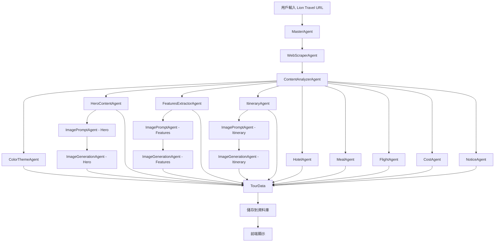

# PackGo Travel 實作計畫：Sipincollection 風格設計與 AI Agents 配合方案

**作者**：Manus AI  
**日期**：2026-01-26  
**版本**：1.0

---

## 執行摘要

本文檔根據 [Sipincollection.com 設計分析總結報告](./SIPIN_DESIGN_SUMMARY.md) 的研究成果，提供 PackGo Travel 行程詳情頁面的詳細實作計畫。本計畫涵蓋前端組件架構、AI Agents 配合方案、資料流設計、以及具體的開發步驟，旨在實現與 Sipincollection 相媲美的視覺效果和用戶體驗。

**核心目標**：
1. 實作目的地導向的配色系統
2. 實作圖文交錯的不對稱佈局
3. 實作直式標題的藝術感設計
4. 實作全寬背景色區塊
5. 實作標籤和標記系統
6. 確保 AI Agents 能自動生成高品質的內容和圖片

---

## 目錄

1. [前端組件架構](#一前端組件架構)
2. [AI Agents 配合方案](#二ai-agents-配合方案)
3. [資料流設計](#三資料流設計)
4. [實作步驟](#四實作步驟)
5. [測試與驗證](#五測試與驗證)
6. [風險與挑戰](#六風險與挑戰)

---

## 一、前端組件架構

### 1.1 組件層級結構

```
TourDetailNew.tsx (主容器)
├── StickyNav (固定導航列)
├── HeroSection (第一屏)
│   ├── VerticalTitle (直式標題)
│   └── HeroImage (大圖)
├── FeaturesSection (特色區塊 - 三圖並排)
│   └── FeatureCard (單張特色卡片)
├── ImageTextBlock (圖文交錯區塊 - 左大右小)
│   ├── MainImage (主圖)
│   ├── OverlayImage (重疊小圖)
│   └── TextContent (文字內容)
├── FullWidthSection (全寬背景區塊)
│   ├── BackgroundColor (背景色)
│   ├── ContentGrid (內容網格)
│   └── ImageGallery (小圖組)
├── DailyItinerary (每日行程)
│   └── DayCard (單日卡片)
├── HotelsSection (飯店介紹)
│   └── HotelCard (單間飯店卡片)
├── MealsSection (餐食介紹)
│   └── MealCard (單餐卡片)
├── CostSection (費用說明)
├── NoticesSection (旅遊須知)
└── DepartureDatesSection (出發日與價格)
```

### 1.2 核心組件詳細設計

#### 1.2.1 StickyNav（固定導航列）

**功能**：
- 顯示行程名稱
- 提供快速連結（特色介紹、出發日與價格、更多相關行程）
- 滾動時固定在頁面頂部

**實作細節**：
```tsx
// client/src/components/tour/StickyNav.tsx
interface StickyNavProps {
  tourTitle: string;
  colorTheme: ColorTheme;
}

export const StickyNav: React.FC<StickyNavProps> = ({ tourTitle, colorTheme }) => {
  const [isSticky, setIsSticky] = useState(false);

  useEffect(() => {
    const handleScroll = () => {
      setIsSticky(window.scrollY > 100);
    };
    window.addEventListener('scroll', handleScroll);
    return () => window.removeEventListener('scroll', handleScroll);
  }, []);

  return (
    <nav
      className={`w-full transition-all duration-300 ${
        isSticky ? 'fixed top-0 left-0 z-50 shadow-lg' : 'relative'
      }`}
      style={{ backgroundColor: '#333' }}
    >
      <div className="container mx-auto px-4 py-4 flex items-center justify-between">
        <h1 className="text-white text-xl font-bold truncate">{tourTitle}</h1>
        <div className="flex gap-6">
          <a href="#features" className="text-white hover:text-gray-300">特色介紹</a>
          <a href="#dates" className="text-white hover:text-gray-300">出發日與價格</a>
          <a href="#related" className="text-white hover:text-gray-300">更多相關行程</a>
        </div>
      </div>
    </nav>
  );
};
```

**AI Agents 配合**：
- 不需要 AI 生成，使用 `tourData.title` 直接顯示

---

#### 1.2.2 HeroSection（第一屏）

**功能**：
- 左側：直式標題 + 副標題 + 關鍵詞
- 右側：大圖（飯店、風景、特色景點）

**實作細節**：
```tsx
// client/src/components/tour/HeroSection.tsx
interface HeroSectionProps {
  title: string;
  subtitle: string;
  keywords: string[];
  heroImage: string;
  colorTheme: ColorTheme;
}

export const HeroSection: React.FC<HeroSectionProps> = ({
  title,
  subtitle,
  keywords,
  heroImage,
  colorTheme,
}) => {
  return (
    <section className="w-full py-16 bg-gray-50">
      <div className="container mx-auto px-4 flex flex-col lg:flex-row items-center gap-12">
        {/* 左側：直式標題 + 副標題 + 關鍵詞 */}
        <div className="w-full lg:w-1/3 flex flex-col lg:flex-row items-start gap-8">
          {/* 直式標題（桃面版直排，手機版橫排） */}
          <h1
            className="vertical-title text-5xl lg:text-6xl font-serif font-bold"
            style={{
              color: colorTheme.primary,
            }}
          >
            {title}
          </h1>

          {/* 副標題 + 關鍵詞 */}
          <div className="flex flex-col gap-4">
            <h2 className="text-2xl font-bold text-gray-900">{subtitle}</h2>
            <div className="flex flex-wrap gap-2">
              {keywords.map((keyword, index) => (
                <span
                  key={index}
                  className="px-3 py-1 text-sm rounded-full"
                  style={{
                    backgroundColor: `${colorTheme.accent}20`,
                    color: colorTheme.accent,
                  }}
                >
                  {keyword}
                </span>
              ))}
            </div>
          </div>
        </div>

        {/* 右側：大圖 */}
        <div className="w-2/3">
          
        </div>
      </div>
    </section>
  );
};
```

**AI Agents 配合**：
- **ContentAnalyzerAgent**：生成 `subtitle` 和 `keywords`
- **ImageGenerationAgent**：生成 `heroImage`（封面圖）
- **ColorThemeAgent**：生成 `colorTheme`

**資料結構**：
```typescript
interface HeroData {
  title: string; // 從 tourData.title
  subtitle: string; // AI 生成
  keywords: string[]; // AI 生成（如：「米其林一星」、「房內私湯」、「札幌漫遊」）
  heroImage: string; // AI 生成
  colorTheme: ColorTheme; // AI 生成
}
```

---

#### 1.2.3 FeaturesSection（特色區塊 - 三圖並排）

**功能**：
- 三張等寬圖片並排
- 每張圖片下方有金色標籤（如 ONSEN、LOBBY、STAY）
- 上方有標題和說明文字

**實作細節**：
```tsx
// client/src/components/tour/FeaturesSection.tsx
interface Feature {
  image: string;
  label: string;
  title: string;
  description: string;
}

interface FeaturesSectionProps {
  features: Feature[];
  colorTheme: ColorTheme;
}

export const FeaturesSection: React.FC<FeaturesSectionProps> = ({
  features,
  colorTheme,
}) => {
  return (
    <section id="features" className="w-full py-16 bg-white">
      <div className="container mx-auto px-4">
        <h2 className="text-3xl font-bold text-center mb-12">一生必遊</h2>
        <div className="grid grid-cols-1 md:grid-cols-3 gap-8">
          {features.map((feature, index) => (
            <div key={index} className="relative">
              
              {/* 金色標籤 */}
              <div
                className="absolute bottom-4 left-4 px-4 py-2 rounded text-white font-bold"
                style={{ backgroundColor: colorTheme.accent }}
              >
                {feature.label}
              </div>
              {/* 標題和說明 */}
              <div className="mt-4">
                <h3 className="text-xl font-bold mb-2">{feature.title}</h3>
                <p className="text-gray-700 leading-relaxed">{feature.description}</p>
              </div>
            </div>
          ))}
        </div>
      </div>
    </section>
  );
};
```

**AI Agents 配合**：
- **ContentAnalyzerAgent**：從行程內容中提取 3 個核心特色
- **ImagePromptAgent**：為每個特色生成圖片提示詞
- **ImageGenerationAgent**：生成 3 張特色圖片

**資料結構**：
```typescript
interface Feature {
  image: string; // AI 生成
  label: string; // AI 生成（如：ONSEN、LOBBY、STAY）
  title: string; // AI 生成（如：「星野 TOMAMU 度假村」）
  description: string; // AI 生成（100-150字）
}
```

---

#### 1.2.4 ImageTextBlock（圖文交錯區塊 - 左大右小）

**功能**：
- 左側大圖佔 60-70%
- 右側小圖佔 30-40%，重疊在大圖上
- 增加層次感

**實作細節**：
```tsx
// client/src/components/tour/ImageTextBlock.tsx
interface ImageTextBlockProps {
  mainImage: string;
  overlayImage: string;
  title: string;
  description: string;
  colorTheme: ColorTheme;
}

export const ImageTextBlock: React.FC<ImageTextBlockProps> = ({
  mainImage,
  overlayImage,
  title,
  description,
  colorTheme,
}) => {
  return (
    <section className="w-full py-16 bg-gray-50">
      <div className="container mx-auto px-4 flex items-center gap-8">
        {/* 左側：大圖 + 重疊小圖 */}
        <div className="w-2/3 relative">
          
          {/* 右下角重疊小圖 */}
          
        </div>

        {/* 右側：文字 */}
        <div className="w-1/3">
          <h3
            className="text-3xl font-bold mb-4"
            style={{ color: colorTheme.primary }}
          >
            {title}
          </h3>
          <p className="text-gray-700 leading-relaxed">{description}</p>
        </div>
      </div>
    </section>
  );
};
```

**AI Agents 配合**：
- **ContentAnalyzerAgent**：從行程內容中提取 1-2 個重點景點或體驗
- **ImagePromptAgent**：為主圖和重疊小圖生成提示詞
- **ImageGenerationAgent**：生成 2 張圖片

---

#### 1.2.5 FullWidthSection（全寬背景區塊）

**功能**：
- 全寬彩色背景
- 左側大圖 + 右側文字
- 右下角有小圖組（2-3張）交疊排列

**實作細節**：
```tsx
// client/src/components/tour/FullWidthSection.tsx
interface FullWidthSectionProps {
  backgroundColor: string;
  title: string;
  description: string;
  mainImage: string;
  smallImages: string[];
  colorTheme: ColorTheme;
}

export const FullWidthSection: React.FC<FullWidthSectionProps> = ({
  backgroundColor,
  title,
  description,
  mainImage,
  smallImages,
  colorTheme,
}) => {
  return (
    <section
      className="w-full py-16"
      style={{
        background: `linear-gradient(to right, ${backgroundColor}20, ${backgroundColor}40)`,
      }}
    >
      <div className="container mx-auto px-4 flex items-center gap-12">
        {/* 左側：大圖 */}
        <div className="w-1/2">
          
        </div>

        {/* 右側：文字 + 小圖組 */}
        <div className="w-1/2 relative">
          <h3
            className="text-3xl font-bold mb-4"
            style={{ color: colorTheme.primary }}
          >
            {title}
          </h3>
          <p className="text-gray-800 leading-relaxed mb-8">{description}</p>

          {/* 小圖組（交疊排列） */}
          <div className="flex gap-4">
            {smallImages.map((image, index) => (
              
            ))}
          </div>
        </div>
      </div>
    </section>
  );
};
```

**AI Agents 配合**：
- **ContentAnalyzerAgent**：提取「期間限定」或「特別安排」的內容
- **ImagePromptAgent**：為主圖和小圖組生成提示詞
- **ImageGenerationAgent**：生成 1 張主圖 + 2-3 張小圖

---

### 1.3**響應式設計策略**

**桃面（Desktop）**：
- 圖文左右排列
- 三圖並排
- 直式標題（`writing-mode: vertical-rl`）

**平板（Tablet）**：
- 圖文上下排列
- 三圖變成兩圖並排 + 一圖獨立
- 直式標題改為橫排

**手機（Mobile）**：
- 單欄佈局
- 圖片全寬
- 直式標題強制橫排（防止破版）

**實作方式**：
```tsx
// 使用 Tailwind CSS 的響應式類別
<div className="flex flex-col md:flex-row items-center gap-8">
  {/* 桃面：左右排列，手機：上下排列 */}
</div>

<div className="grid grid-cols-1 md:grid-cols-2 lg:grid-cols-3 gap-8">
  {/* 手機：1欄，平板：2欄，桃面：3欄 */}
</div>
```

**⚠️ Tech Lead 審查意見：直式標題的 Mobile RWD**

直式標題在手機版會導致破版，必須加入 Media Query。

**解決方案**：在 `client/src/index.css` 中加入以下 CSS：

```css
/* 直式標題的 RWD 處理 */
.vertical-title {
  /* 手機版：強制橫排，防止破版 */
  writing-mode: horizontal-tb;
}

/* 桃面版：啟用直排 */
@media (min-width: 1024px) {
  .vertical-title {
    writing-mode: vertical-rl;
  }
}
```

**使用方式**：
```tsx
<h1 className="vertical-title text-5xl lg:text-6xl font-serif font-bold">
  {title}
</h1>
```--

## 二、AI Agents 配合方案

### 2.1 現有 Agents 架構

根據 `server/agents/` 目錄，PackGo Travel 目前有以下 Agents：

| Agent 名稱 | 職責 | 輸入 | 輸出 |
|-----------|------|------|------|
| `masterAgent.ts` | 協調所有 Agents | Lion Travel URL | 完整 TourData |
| `webScraperAgent.ts` | 抓取外部網站內容 | URL | 原始 HTML |
| `contentAnalyzerAgent.ts` | 分析和結構化內容 | 原始 HTML | 結構化資料 |
| `colorThemeAgent.ts` | 生成配色方案 | 目的地 | ColorTheme |
| `imagePromptAgent.ts` | 生成圖片提示詞 | 景點/活動描述 | 圖片提示詞 |
| `imageGenerationAgent.ts` | 生成圖片 | 圖片提示詞 | 圖片 URL |
| `itineraryAgent.ts` | 生成每日行程 | 行程資料 | 每日行程 |
| `hotelAgent.ts` | 生成飯店介紹 | 飯店資料 | 飯店介紹 |
| `mealAgent.ts` | 生成餐食介紹 | 餐食資料 | 餐食介紹 |
| `flightAgent.ts` | 生成航班資訊 | 航班資料 | 航班資訊 |
| `costAgent.ts` | 生成費用說明 | 費用資料 | 費用說明 |
| `noticeAgent.ts` | 生成旅遊須知 | 須知資料 | 旅遊須知 |
| `skillLibrary.ts` | Skill Prompting | - | 專業人設 |

### 2.2 新增/修改 Agents

為了實現 Sipincollection 風格的設計，需要新增或修改以下 Agents：

#### 2.2.1 HeroContentAgent（新增）

**職責**：生成 Hero Section 的內容

**輸入**：
```typescript
interface HeroContentInput {
  title: string; // 行程標題
  country: string; // 國家
  city: string; // 城市
  days: number; // 天數
  highlights: string[]; // 行程亮點
}
```

**輸出**：
```typescript
interface HeroContentOutput {
  subtitle: string; // 副標題（如：「馬特拉古城·蘑菇村彩色島·威尼斯五星連泊」）
  keywords: string[]; // 關鍵詞（如：「米其林一星」、「房內私湯」、「札幌漫遊」）
}
```

**Skill Prompting**：
```typescript
const HERO_CONTENT_SKILL = {
  role: "SENIOR_TRAVEL_COPYWRITER",
  persona: "資深旅遊文案編輯，擅長提煉行程亮點，創作吸引人的標題和關鍵詞",
  instructions: [
    "分析行程亮點，提取 3-5 個最吸引人的關鍵詞",
    "副標題應簡潔有力，突出行程的獨特性",
    "關鍵詞應使用「·」分隔，營造詩意感",
    "避免使用過於商業化的詞彙",
  ],
};
```

**實作範例**：
```typescript
// server/agents/heroContentAgent.ts
export const generateHeroContent = async (input: HeroContentInput): Promise<HeroContentOutput> => {
  const prompt = `
你是一位資深旅遊文案編輯，擅長提煉行程亮點，創作吸引人的標題和關鍵詞。

請根據以下行程資訊，生成副標題和關鍵詞：

**行程標題**：${input.title}
**目的地**：${input.country} ${input.city}
**天數**：${input.days} 天
**行程亮點**：
${input.highlights.map((h, i) => `${i + 1}. ${h}`).join('\n')}

**要求**：
1. 副標題應簡潔有力，突出行程的獨特性（15-30字）
2. 關鍵詞應提取 3-5 個最吸引人的亮點（如：「米其林一星」、「房內私湯」、「札幌漫遊」）
3. 關鍵詞應使用「·」分隔，營造詩意感
4. 避免使用過於商業化的詞彙

請以 JSON 格式回應：
{
  "subtitle": "副標題",
  "keywords": ["關鍵詞1", "關鍵詞2", "關鍵詞3"]
}
`;

  const response = await invokeLLM({
    messages: [
      { role: "system", content: HERO_CONTENT_SKILL.instructions.join('\n') },
      { role: "user", content: prompt },
    ],
    response_format: {
      type: "json_schema",
      json_schema: {
        name: "hero_content",
        strict: true,
        schema: {
          type: "object",
          properties: {
            subtitle: { type: "string" },
            keywords: { type: "array", items: { type: "string" } },
          },
          required: ["subtitle", "keywords"],
          additionalProperties: false,
        },
      },
    },
  });

  return JSON.parse(response.choices[0].message.content);
};
```

---

#### 2.2.2 FeaturesExtractorAgent（新增）

**職責**：從行程內容中提取 3 個核心特色

**輸入**：
```typescript
interface FeaturesExtractorInput {
  itinerary: string; // 每日行程
  hotels: string; // 飯店資訊
  meals: string; // 餐食資訊
  highlights: string[]; // 行程亮點
}
```

**輸出**：
```typescript
interface Feature {
  label: string; // 標籤（如：ONSEN、LOBBY、STAY）
  title: string; // 標題（如：「星野 TOMAMU 度假村」）
  description: string; // 說明（100-150字）
  imagePrompt: string; // 圖片提示詞
}

interface FeaturesExtractorOutput {
  features: Feature[]; // 3 個特色
}
```

**Skill Prompting**：
```typescript
const FEATURES_EXTRACTOR_SKILL = {
  role: "TRAVEL_EXPERIENCE_CURATOR",
  persona: "旅遊體驗策展人，擅長從行程中提取最具吸引力的特色體驗",
  instructions: [
    "從行程中提取 3 個最具吸引力的特色體驗",
    "每個特色應包含標籤、標題、說明",
    "標籤應簡潔有力（如：ONSEN、LOBBY、STAY）",
    "說明應具體生動，突出體驗的獨特性（100-150字）",
  ],
};
```

---

#### 2.2.3 ColorThemeAgent（修改）

**現有功能**：根據目的地生成配色方案

**修改建議**：
1. 增加更多目的地的配色方案
2. 根據 Sipincollection 的配色邏輯調整

**實作範例**：
```typescript
// server/agents/colorThemeAgent.ts
export const generateColorTheme = (destination: string): ColorTheme => {
  const colorMap: Record<string, ColorTheme> = {
    // 日本
    '北海道': { primary: '#7B68EE', secondary: '#A9C5D6', accent: '#FFD700' },
    '東京': { primary: '#FF6B6B', secondary: '#4ECDC4', accent: '#FFE66D' },
    '京都': { primary: '#8B4513', secondary: '#D2691E', accent: '#FFD700' },
    '沖繩': { primary: '#00CED1', secondary: '#87CEEB', accent: '#FFD700' },

    // 歐洲
    '義大利': { primary: '#D4A574', secondary: '#8B4513', accent: '#DC143C' },
    '法國': { primary: '#4169E1', secondary: '#FFD700', accent: '#DC143C' },
    '西班牙': { primary: '#FF6347', secondary: '#FFD700', accent: '#8B4513' },
    '希臘': { primary: '#4682B4', secondary: '#87CEEB', accent: '#FFD700' },

    // 非洲
    '肯亞': { primary: '#FFD700', secondary: '#000000', accent: '#FF6347' },
    '摩洛哥': { primary: '#FFA500', secondary: '#4682B4', accent: '#F4A460' },
    '埃及': { primary: '#DAA520', secondary: '#8B4513', accent: '#FFD700' },

    // 亞洲
    '泰國': { primary: '#FFD700', secondary: '#FF6347', accent: '#4169E1' },
    '峇里島': { primary: '#32CD32', secondary: '#00CED1', accent: '#FFD700' },
    '越南': { primary: '#FF6347', secondary: '#FFD700', accent: '#32CD32' },

    // 美洲
    '美國': { primary: '#4169E1', secondary: '#DC143C', accent: '#FFD700' },
    '加拿大': { primary: '#DC143C', secondary: '#FFD700', accent: '#4169E1' },
    '秘魯': { primary: '#8B4513', secondary: '#FFD700', accent: '#32CD32' },

    // 大洋洲
    '澳洲': { primary: '#FFD700', secondary: '#4682B4', accent: '#FF6347' },
    '紐西蘭': { primary: '#32CD32', secondary: '#4682B4', accent: '#FFD700' },
  };

  // 如果找不到對應的目的地，使用預設配色
  return colorMap[destination] || {
    primary: '#4682B4',
    secondary: '#87CEEB',
    accent: '#FFD700',
  };
};
```

---

#### 2.2.4 ImagePromptAgent（修改）

**現有功能**：生成圖片提示詞

**修改建議**：
1. 增加「封面圖」的提示詞生成
2. 增加「特色圖片」的提示詞生成
3. 增加「圖文交錯區塊」的提示詞生成

**實作範例**：
```typescript
// server/agents/imagePromptAgent.ts

// 1. 封面圖提示詞
export const generateHeroImagePrompt = (input: {
  country: string;
  city: string;
  keywords: string[];
}): string => {
  return `
A stunning landscape photograph of ${input.city}, ${input.country}.
Keywords: ${input.keywords.join(', ')}.
Style: Cinematic, wide-angle, golden hour lighting, high-quality travel photography.
Mood: Inspiring, adventurous, luxurious.
No text, no watermarks, no people.
`;
};

// 2. 特色圖片提示詞
export const generateFeatureImagePrompt = (feature: {
  label: string;
  title: string;
  description: string;
}): string => {
  return `
A high-quality photograph of ${feature.title}.
Description: ${feature.description}.
Style: Professional travel photography, warm lighting, inviting atmosphere.
Focus: ${feature.label === 'ONSEN' ? 'Hot spring, traditional Japanese bath' : feature.label === 'LOBBY' ? 'Luxury hotel lobby, elegant interior' : 'Luxury accommodation, comfortable room'}.
No text, no watermarks, no people.
`;
};

// 3. 圖文交錯區塊提示詞
export const generateImageTextBlockPrompt = (input: {
  title: string;
  description: string;
  isMainImage: boolean;
}): string => {
  return `
A ${input.isMainImage ? 'wide-angle' : 'close-up'} photograph of ${input.title}.
Description: ${input.description}.
Style: Professional travel photography, natural lighting, authentic atmosphere.
Mood: Immersive, experiential, memorable.
No text, no watermarks, minimal people.
`;
};
```

---

### 2.3 Agents 協作流程

**完整流程**：



**步驟說明**：

1. **用戶輸入 Lion Travel URL**
2. **MasterAgent** 協調所有 Agents
3. **WebScraperAgent** 抓取外部網站內容
4. **ContentAnalyzerAgent** 分析和結構化內容
5. **ColorThemeAgent** 根據目的地生成配色方案
6. **HeroContentAgent** 生成 Hero Section 的內容（副標題、關鍵詞）
7. **FeaturesExtractorAgent** 提取 3 個核心特色
8. **ItineraryAgent** 生成每日行程
9. **HotelAgent** 生成飯店介紹
10. **MealAgent** 生成餐食介紹
11. **FlightAgent** 生成航班資訊
12. **CostAgent** 生成費用說明
13. **NoticeAgent** 生成旅遊須知
14. **ImagePromptAgent** 為 Hero、Features、Itinerary 生成圖片提示詞
15. **ImageGenerationAgent** 生成所有圖片
16. **所有資料匯總到 TourData**
17. **儲存到資料庫**
18. **前端顯示**

---

### 2.4 Partial Success 策略

**問題**：如果某個 Agent 失敗，整個流程會中斷嗎？

**解決方案**：實作 Partial Success 策略，即使部分內容生成失敗，也能顯示完整頁面。

**實作方式**：

```typescript
// server/agents/masterAgent.ts
export const generateTourData = async (url: string): Promise<TourData> => {
  const results = {
    colorTheme: null,
    heroContent: null,
    features: null,
    itinerary: null,
    hotels: null,
    meals: null,
    flights: null,
    cost: null,
    notices: null,
    heroImage: null,
    featureImages: [],
    itineraryImages: [],
  };

  try {
    // 1. 抓取和分析內容（必須成功）
    const scrapedData = await webScraperAgent(url);
    const analyzedData = await contentAnalyzerAgent(scrapedData);

    // 2. 生成配色方案（Fallback：預設配色）
    try {
      results.colorTheme = await colorThemeAgent(analyzedData.country);
    } catch (error) {
      console.error('ColorThemeAgent failed, using default theme', error);
      results.colorTheme = { primary: '#4682B4', secondary: '#87CEEB', accent: '#FFD700' };
    }

    // 3. 生成 Hero Content（Fallback：使用原始標題）
    try {
      results.heroContent = await heroContentAgent(analyzedData);
    } catch (error) {
      console.error('HeroContentAgent failed, using fallback', error);
      results.heroContent = {
        subtitle: analyzedData.title,
        keywords: [],
      };
    }

    // 4. 生成 Features（Fallback：空陣列）
    try {
      results.features = await featuresExtractorAgent(analyzedData);
    } catch (error) {
      console.error('FeaturesExtractorAgent failed, using empty array', error);
      results.features = [];
    }

    // ... 其他 Agents 同理

    // 5. 生成圖片（Fallback：使用預設圖片或 Unsplash）
    try {
      results.heroImage = await imageGenerationAgent(heroImagePrompt);
    } catch (error) {
      console.error('ImageGenerationAgent failed for hero image, using fallback', error);
      results.heroImage = `https://source.unsplash.com/1600x900/?${analyzedData.country},landscape`;
    }

    // ... 其他圖片同理

  } catch (error) {
    console.error('Critical error in generateTourData', error);
    throw error; // 只有關鍵錯誤才拋出
  }

  return results;
};
```

---

## 三、資料流設計

### 3.1 資料結構

**TourData（完整資料結構）**：

```typescript
interface TourData {
  // 基本資訊
  id: string;
  title: string;
  country: string;
  city: string;
  days: number;
  nights: number;
  price: number;
  currency: string;

  // 配色方案
  colorTheme: ColorTheme;

  // Hero Section
  heroContent: {
    subtitle: string;
    keywords: string[];
  };
  heroImage: string;

  // Features Section
  features: Feature[];

  // Image Text Block
  imageTextBlocks: ImageTextBlock[];

  // Full Width Section
  fullWidthSections: FullWidthSection[];

  // 每日行程
  itinerary: DailyItinerary[];

  // 飯店
  hotels: Hotel[];

  // 餐食
  meals: Meal[];

  // 航班
  flights: Flight[];

  // 費用說明
  cost: Cost;

  // 旅遊須知
  notices: Notice[];

  // 出發日期
  departureDates: DepartureDate[];
}

interface ColorTheme {
  primary: string; // 主色
  secondary: string; // 輔助色
  accent: string; // 強調色
}

interface Feature {
  image: string;
  label: string;
  title: string;
  description: string;
}

interface ImageTextBlock {
  mainImage: string;
  overlayImage: string;
  title: string;
  description: string;
}

interface FullWidthSection {
  backgroundColor: string;
  title: string;
  description: string;
  mainImage: string;
  smallImages: string[];
}

interface DailyItinerary {
  day: number;
  title: string;
  description: string;
  activities: Activity[];
  meals: string[];
  accommodation: string;
  images: string[];
}

interface Hotel {
  name: string;
  stars: number;
  description: string;
  images: string[];
}

interface Meal {
  type: string; // 早餐、午餐、晚餐
  name: string;
  description: string;
  images: string[];
}

interface Flight {
  airline: string;
  flightNumber: string;
  departure: string;
  arrival: string;
  departureTime: string;
  arrivalTime: string;
}

interface Cost {
  included: string[];
  excluded: string[];
  notes: string[];
}

interface Notice {
  category: string;
  content: string;
}

interface DepartureDate {
  date: string;
  price: number;
  availability: string;
}
```

### 3.2 資料庫 Schema

**tours 表**：

```typescript
// drizzle/schema.ts
export const tours = sqliteTable('tours', {
  id: text('id').primaryKey(),
  title: text('title').notNull(),
  country: text('country').notNull(),
  city: text('city').notNull(),
  days: integer('days').notNull(),
  nights: integer('nights').notNull(),
  price: real('price').notNull(),
  currency: text('currency').notNull().default('TWD'),

  // 配色方案（JSON）
  colorTheme: text('color_theme').notNull(), // JSON.stringify(ColorTheme)

  // Hero Section（JSON）
  heroContent: text('hero_content').notNull(), // JSON.stringify(HeroContent)
  heroImage: text('hero_image').notNull(),

  // Features Section（JSON）
  features: text('features').notNull(), // JSON.stringify(Feature[])

  // Image Text Block（JSON）
  imageTextBlocks: text('image_text_blocks'), // JSON.stringify(ImageTextBlock[])

  // Full Width Section（JSON）
  fullWidthSections: text('full_width_sections'), // JSON.stringify(FullWidthSection[])

  // 每日行程（JSON）
  itinerary: text('itinerary').notNull(), // JSON.stringify(DailyItinerary[])

  // 飯店（JSON）
  hotels: text('hotels'), // JSON.stringify(Hotel[])

  // 餐食（JSON）
  meals: text('meals'), // JSON.stringify(Meal[])

  // 航班（JSON）
  flights: text('flights'), // JSON.stringify(Flight[])

  // 費用說明（JSON）
  cost: text('cost'), // JSON.stringify(Cost)

  // 旅遊須知（JSON）
  notices: text('notices'), // JSON.stringify(Notice[])

  // 出發日期（JSON）
  departureDates: text('departure_dates'), // JSON.stringify(DepartureDate[])

  // 時間戳
  createdAt: integer('created_at', { mode: 'timestamp' }).notNull().default(sql`(unixepoch())`),
  updatedAt: integer('updated_at', { mode: 'timestamp' }).notNull().default(sql`(unixepoch())`),
});
```

### 3.3 API 設計

**tRPC Procedures**：

```typescript
// server/routers.ts
export const appRouter = router({
  tours: router({
    // 生成行程
    generate: protectedProcedure
      .input(z.object({ url: z.string().url() }))
      .mutation(async ({ input }) => {
        const tourData = await generateTourData(input.url);
        const tourId = await saveTourData(tourData);
        return { tourId };
      }),

    // 獲取行程詳情
    getById: publicProcedure
      .input(z.object({ id: z.string() }))
      .query(async ({ input }) => {
        const tour = await getTourById(input.id);
        return tour;
      }),

    // 列出所有行程
    list: publicProcedure
      .input(z.object({
        country: z.string().optional(),
        city: z.string().optional(),
        minPrice: z.number().optional(),
        maxPrice: z.number().optional(),
      }))
      .query(async ({ input }) => {
        const tours = await listTours(input);
        return tours;
      }),
  }),
});
```

---

## 四、實作步驟

### 4.1 Phase 1：基礎架構（1-2 天）

**目標**：建立基礎組件和資料結構

**任務**：
1. ✅ 創建 `StickyNav` 組件
2. ✅ 創建 `HeroSection` 組件
3. ✅ 創建 `FeaturesSection` 組件
4. ✅ 創建 `ImageTextBlock` 組件
5. ✅ 創建 `FullWidthSection` 組件
6. ✅ 更新 `TourDetailNew.tsx`，整合所有組件
7. ✅ 更新資料庫 Schema
8. ✅ 更新 tRPC Procedures

**驗收標準**：
- 所有組件能正常顯示（使用假資料）
- 響應式設計正常運作
- 資料庫 Schema 更新完成

---

### 4.2 Phase 2：AI Agents 整合（2-3 天）

**目標**：實作和整合所有 AI Agents

**任務**：
1. ✅ 實作 `HeroContentAgent`
2. ✅ 實作 `FeaturesExtractorAgent`
3. ✅ 修改 `ColorThemeAgent`（增加更多目的地）
4. ✅ 修改 `ImagePromptAgent`（增加封面圖、特色圖片提示詞）
5. ✅ 修改 `MasterAgent`（整合新 Agents）
6. ✅ 實作 Partial Success 策略
7. ✅ 測試完整流程

**驗收標準**：
- 所有 Agents 能正常運作
- Partial Success 策略正常運作
- 使用 Lion Travel URL 測試，能生成完整行程

---

### 4.3 Phase 3：視覺優化（1-2 天）

**目標**：優化視覺效果，確保與 Sipincollection 風格一致

**任務**：
1. ✅ 調整配色方案（根據 Sipincollection 的配色邏輯）
2. ✅ 調整字體（使用 Noto Serif TC、Noto Sans TC）
3. ✅ 調整留白和間距
4. ✅ 調整圖片比例和圓角
5. ✅ 調整陰影效果
6. ✅ 實作防禦性 CSS
7. ✅ 實作 Print CSS

**驗收標準**：
- 視覺效果與 Sipincollection 風格一致
- 防禦性 CSS 正常運作（處理內容長度不一致）
- Print CSS 正常運作

---

### 4.4 Phase 4：測試與優化（1-2 天）

**目標**：測試完整流程，修復 Bug

**任務**：
1. ✅ 使用多個 Lion Travel URL 測試
2. ✅ 檢查配色方案是否正確應用
3. ✅ 檢查圖片是否正確顯示
4. ✅ 檢查響應式設計是否正常
5. ✅ 檢查 Print CSS 是否正常
6. ✅ 修復發現的 Bug
7. ✅ 優化效能

**驗收標準**：
- 所有測試案例通過
- 無明顯 Bug
- 效能符合預期

---

### 4.5 Phase 5：文檔與部署（1 天）

**目標**：撰寫文檔，部署到生產環境

**任務**：
1. ✅ 撰寫「行程生成流程完整報告」
2. ✅ 更新 README.md
3. ✅ 更新 todo.md
4. ✅ 創建 checkpoint
5. ✅ 部署到生產環境

**驗收標準**：
- 文檔完整
- checkpoint 創建成功
- 生產環境正常運作

---

## 五、測試與驗證

### 5.1 測試案例

**測試案例 1：北海道行程**
- URL：https://travel.liontravel.com/detail?NormGroupID=c684d4d8-4860-47a3-94e3-debb05bce5b2
- 預期配色：紫色 + 藍灰色
- 預期關鍵詞：「米其林一星」、「房內私湯」、「札幌漫遊」

**測試案例 2：義大利行程**
- URL：https://travel.liontravel.com/detail?NormGroupID=...
- 預期配色：暖色調（橙黃、土黃、紅色）
- 預期關鍵詞：「威尼斯五星連泊」、「托斯卡尼莊園」、「米其林餐廳」

**測試案例 3：肯亞行程**
- URL：https://travel.liontravel.com/detail?NormGroupID=...
- 預期配色：金黃色 + 黑色
- 預期關鍵詞：「動物大遷徙」、「五星飯店」、「獅王傳奇」

### 5.2 驗收標準

**功能性**：
- ✅ 所有組件正常顯示
- ✅ 配色方案正確應用
- ✅ 圖片正確顯示
- ✅ 響應式設計正常
- ✅ Print CSS 正常

**視覺效果**：
- ✅ 與 Sipincollection 風格一致
- ✅ 留白充足
- ✅ 字體優雅
- ✅ 圖片品質高

**效能**：
- ✅ 頁面載入時間 < 3 秒
- ✅ 圖片載入時間 < 2 秒
- ✅ AI 生成時間 < 30 秒

---

## 六、風險與挑戰

### 6.1 風險

| 風險 | 影響 | 機率 | 緩解措施 |
|------|------|------|----------|
| AI 生成內容品質不穩定 | 高 | 中 | 實作 Partial Success 策略，使用 Fallback 機制 |
| 圖片生成失敗 | 中 | 中 | 使用 Unsplash 作為 Fallback |
| 配色方案不符合預期 | 中 | 低 | 手動調整配色方案，增加更多目的地 |
| 內容長度不一致 | 中 | 高 | 實作防禦性 CSS，使用 `text-truncate` 和 `overflow-wrap` |
| 響應式設計問題 | 中 | 中 | 使用 Tailwind CSS 的響應式類別，充分測試 |

### 6.2 挑戰

**挑戰 1：自動生成內容的品質控制**

**問題**：AI 生成的內容品質可能不如人工撰寫

**解決方案**：
1. 使用 Skill Prompting，提升 AI 生成內容的品質
2. 實作內容審核機制，過濾低品質內容
3. 提供手動編輯功能，允許用戶修改 AI 生成的內容

---

**挑戰 2：配色方案的一致性**

**問題**：不同目的地的配色方案可能不一致

**解決方案**：
1. 建立完整的配色方案資料庫
2. 根據 Sipincollection 的配色邏輯調整
3. 提供手動調整配色的功能

---

**挑戰 3：圖片品質和相關性**

**問題**：AI 生成的圖片品質可能不如專業攝影

**解決方案**：
1. 使用高品質的圖片提示詞
2. 使用 Unsplash 作為 Fallback
3. 提供手動上傳圖片的功能

---

## 七、總結

本實作計畫提供了詳細的前端組件架構、AI Agents 配合方案、資料流設計、以及具體的開發步驟。通過實作這些組件和 Agents，PackGo Travel 可以實現與 Sipincollection 相媲美的視覺效果和用戶體驗。

**關鍵成功因素**：
1. **Skill Prompting**：使用專業人設提升 AI 生成內容的品質
2. **Partial Success 策略**：即使部分內容生成失敗，也能顯示完整頁面
3. **防禦性設計**：處理內容長度不一致、圖片載入失敗等問題
4. **配色一致性**：演算法自動選擇配色，確保視覺一致性
5. **充分測試**：使用多個測試案例，確保功能正常運作

通過這些措施，PackGo Travel 可以在自動化的同時，保持高品質的視覺呈現和用戶體驗。

---

## 附錄

### A. 參考資料

1. [Sipincollection.com 設計分析總結報告](./SIPIN_DESIGN_SUMMARY.md)
2. [Sipincollection.com 研究過程記錄](./SIPIN_COLLECTION_RESEARCH.md)
3. [Sipincollection 北海道行程](https://sipincollection.com/tour/feature/25JHPHNH6/detail)

### B. 相關文檔

1. [PackGo Travel README](./README.md)
2. [PackGo Travel TODO](./todo.md)
3. [PackGo Travel Agents 架構](./server/agents/)

---

**文檔結束**
